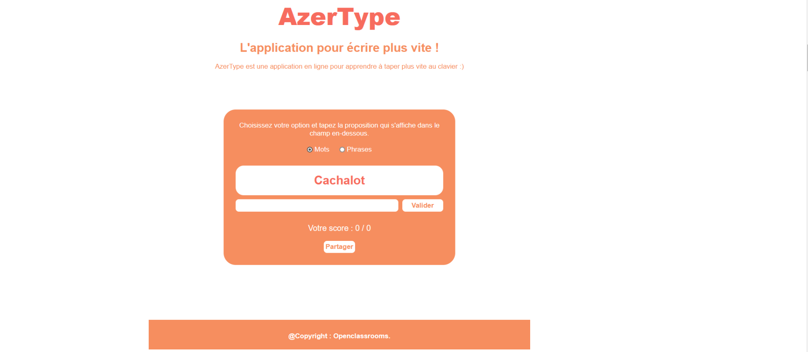

# AzerType

## Description

AzerType est une application en ligne conçue pour aider les utilisateurs à améliorer leur vitesse de frappe au clavier. L'objectif principal de l'application est de permettre aux utilisateurs de taper des mots aussi rapidement que possible dans un laps de temps défini.

Ce projet est le résultat de la formation sur le cours JavaScript d'OpenClassrooms. Le HTML et le CSS ont été fournis dans le cadre de cette formation. C'est le JavaScript que je vais implémenter pour ajouter la fonctionnalité de frappe au clavier.

## Fonctionnalités

- Génération aléatoire de mots à taper.
- Chronomètre pour suivre le temps écoulé pendant la session de frappe.
- Suivi du score de frappe, indiquant le nombre de mots correctement tapés.
- Difficulté croissante avec des mots plus longs ou plus complexes au fur et à mesure que la session progresse.
- Possibilité de régler la durée de la session de frappe.
- Interface utilisateur conviviale et réactive.

## Captures d'écran

<!-- ## Installation

L'application est disponible en ligne et ne nécessite aucune installation sur l'appareil de l'utilisateur. Pour y accéder, il suffit de visiter [AzerType](lien_vers_l_application). -->

<!-- ## Utilisation

1. Ouvrez l'application en suivant le lien.
2. Choisissez la durée de la session de frappe.
3. Commencez à taper dès que les mots apparaissent à l'écran.
4. Essayez de taper autant de mots que possible dans le temps imparti.
5. Consultez votre score à la fin de la session pour suivre votre progression. -->

## Technologies Utilisées

- HTML
- CSS
- JavaScript

## Démo

(Insérez ici un lien vers une démo en ligne de l'application, si disponible)

## Remarques

Toute contribution ou suggestion est la bienvenue. N'hésitez pas à ouvrir une issue ou à proposer une pull request.
